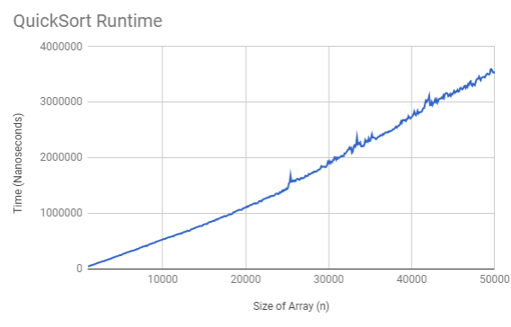

# Pretend Greatness -- Jason Kim, Peter Cwalina
### APCS2 pd8
### L#01 -- What Does the Data Say?
### 2018-03-14

## Hypothesis
We predict that on average, QuickSort runs at O(nlogn) time, but in the worst case, runs at O(n^2). This is because we've seen that the absolute worst case, while O(n^2) is very rare, so on average it's most likely closer to O(nlogn).

## Background
QuickSort is based around the method partition(). Partition, like the name suggests, splits a given array based on the element at a specified index. Numbers, within the boundaries set, are then separated into two groups: numbers lower than the  element at the specified index, and numbers that are greater. This process of partition runs in O(n) time. QuickSort takes advantage of Partition, setting boundaries and separating the data into parts consistently. Once these parts are separated enough, we are left with a sorted array. Now, Partition also requires a pivot point, or the specified index point. Deciding this point is interesting, as there are advantages and disadvantages with every point. However, because the datasets are randomly generated, we decided to choose the element at the far right for consistency. 

## Assessment
- Best Case: O(nlogn)
  - The pivot point always ends up being the median of the dataset.
- Avergae: O(nlogn)
  - The pivot point is around the median of the dataset a majority of the time.
- Worst Case O(n^2)
  - The pivot point is always the largest value or the smallest value everytime.

## Methodology
To time QuickSort and get a sense of the big-O on average, we took advantage of the built in nanoSeconds counter. We first start by warming up, performing 1000 QuickSorts. Once we are done warming up, we start the actual data collecting. We used nested for loops, the first for loop determining the array size, and the second for loop performing QuickSort 1000 times. We decided to collect data for n = 1000, all the way up to n = 50000, in increments of 100. We filled each array with integers between 0 and 1000 and shuffeled them before every QuickSort. Before each sort, we recorded the current time and once each sort was done, we recorded the ending time. We then got the difference, added it to the total, and once the 1000 sorts were done, we divided the total by 1000 to get the average time.

## Results

While it may not seem so at first, this graph represent O(nlogn). It does seem to look linear but using a straightedge, it is more evident that there is indeed a curve in the data. 

## Conclusions
